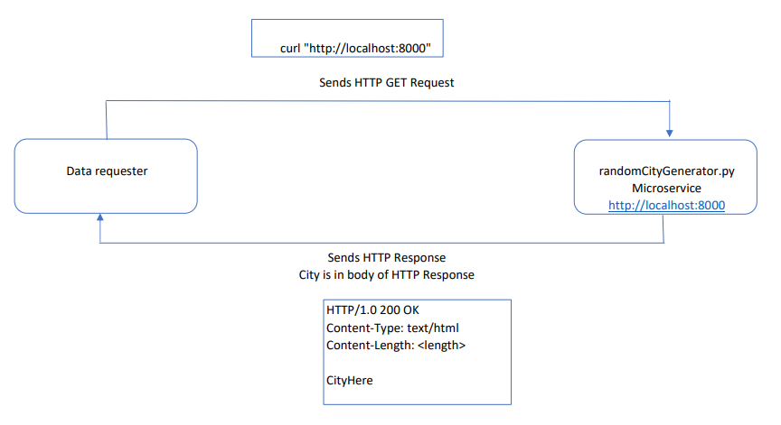

Eva Malpaya  
CS 361, Oregon State University  
Assignment 8  
February 13, 2023  

# Communication Contract


# How to REQUEST data
- Ensure **randomCityGenerator.py** program is running locally in its own command-line instance (instructions to run are further below).
  - When program is running, terminal will display: "Random City Generator listening on port: 8000"
- In **a different command-line instance,** send a HTTP GET request to: http://localhost:8000
  - Example: curl http://localhost:8000
- **Note:** Must run randomCityGenerator.py and send the HTTP GET Request in **two different** command-line instances. Cannot run program and send request in the same command-line instance.

#### Example terminal output of requesting data:
```
evamal@DESKTOP:~$ curl http://localhost:8000
Pasadena
evamal@DESKTOP:~$ curl http://localhost:8000
Berkeley
evamal@DESKTOP:~$ curl http://localhost:8000
Elk Grove
evamal@DESKTOP:~$ curl http://localhost:8000
Ann Arbor
```

# How to RECEIVE data
- Data will be sent back with the random city name in the body of the HTTP response
- Obtain data by accessing the body contents of the HTTP response


# UML Sequence Diagram


# Project contains one (1) .py source code file:
randomCityGenerator/  
├─ randomCityGenerator.py  
├─ README.md  
├─ assign8_uml.PNG  

# How to run randomCityGenerator.py on Linux
- Assumes the user has Python 3 for Linux installed and is running via command-line.
- In a command-line instance, navigate to the folder where the source code files are located.
- Enter `sudo python3 randomCityGenerator.py` (Enter your system password if prompted)
- To quit, enter Ctrl + C

#### Example terminal output of randomCityGenerator.py running on Linux:
```
evamal@DESKTOP:/mnt/c/projects/361assign8/randomCityGenerator$ python3 --version
Python 3.8.10
evamal@DESKTOP:/mnt/c/projects/361assign8/randomCityGenerator$ ls
README.md  randomCityGenerator.py  testClient.py
evamal@DESKTOP:/mnt/c/projects/361assign8/randomCityGenerator$ sudo python randomCityGenerator.py
[sudo] password for evamal:
Random City Generator listening on port: 8000
Connected by ('127.0.0.1', 58807)
Sending: Carrollton
Connected by ('127.0.0.1', 58808)
Sending: Renton
Connected by ('127.0.0.1', 58809)
Sending: Santa Ana
Connected by ('127.0.0.1', 58810)
Sending: Boise
^C
evamal@DESKTOP:/mnt/c/projects/361assign8/randomCityGenerator$
```

# How to run randomCityGenerator.py on Windows
- Assumes the user has Python 3 for Windows installed and setup for use in CMD. Recommended: https://www.geeksforgeeks.org/how-to-set-up-command-prompt-for-python-in-windows10/
- In an instance Windows CMD, navigate to the folder where the source code files are located.
- Enter `python randomCityGenerator.py`
- To quit, enter Ctrl + Pause|Break

#### Example terminal output of randomCityGenerator.py running on Windows:
```
C:\WINDOWS\system32>python --version
Python 3.10.5
C:\projects\361assign8\randomCityGenerator>dir
 Volume in drive C is Windows
 Volume Serial Number is F4E6-8857

 Directory of C:\projects\361assign8\randomCityGenerator

02/12/2023  10:19 PM    <DIR>          .
02/12/2023  10:19 PM    <DIR>          ..
02/12/2023  10:04 PM             7,602 randomCityGenerator.py
02/12/2023  10:17 PM               544 README.md
               2 File(s)          8,146 bytes
               2 Dir(s)  286,486,589,440 bytes free

C:\projects\361assign8\randomCityGenerator>python randomCityGenerator.py
Random City Generator listening on port: 8000
Connected by ('127.0.0.1', 59874)
Sending: Carrollton
Connected by ('127.0.0.1', 59876)
Sending: Seattle
Connected by ('127.0.0.1', 59878)
Sending: Downey
Connected by ('127.0.0.1', 59880)
Sending: Charlotte
Connected by ('127.0.0.1', 59882)
Sending: Joliet
^C
C:\projects\361assign8\randomCityGenerator>
```